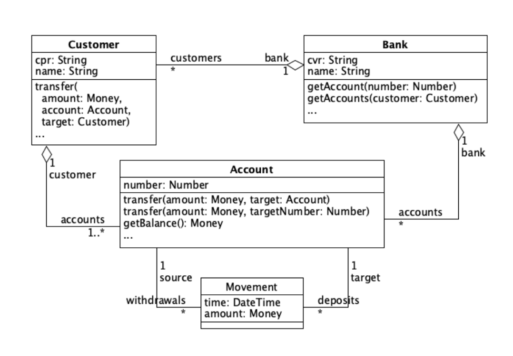

# SoftwareDevelopmentTest

## Assignment #1 - Mocking and TDD
### Group members
* Adam Lass
* Rasmus Helsgaun
* Pernille Lørup

______

Given the diagram above we have implemented the required classes and their respective tests using a Test-Driven Design approach. 

The following table illustrates the use of dummies and stubs in our tests classes.

### Test overview
|Test|Dummy Used|Stub Used|
|----|----------|---------|
|testCreateAccount|y|n|
|testCreateAccountWithBank|y|n|
|testCreateAccountWithNumber|y|n|
|testCreateAccountWithZeroBalance|y|n|
|testTransferPositiveAmount|y|n|
|testTransferPositiveAmountUsingNumber|y|y|
|testRegisterAndGetAccount|y|y|
|testRegisterAndGetCustomer|y|y|
