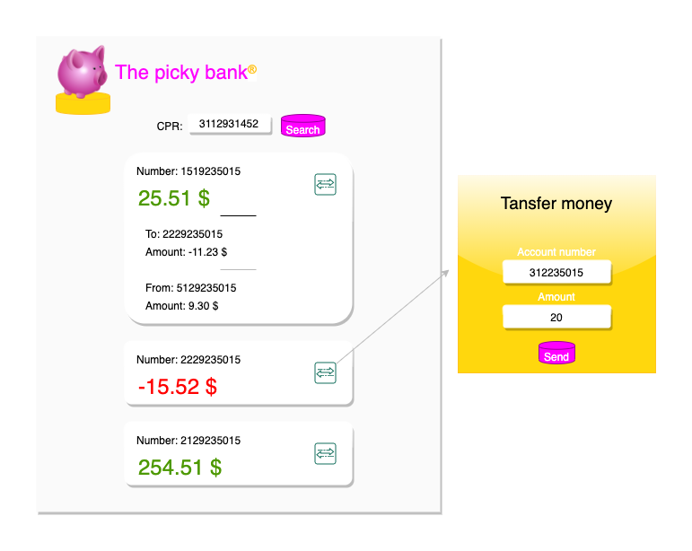

# Integration Testing

## Assignment #2 - Integration Tests - The well tested bank

### Group members
* Adam Lass
* Rasmus Hellsgaun aka Rasmus H8r
* Pernille Lørup

#### The drawing above mocks the functionality of our future bank frontend. 

First you enter the cpr number and press 'Search'. 

Next you will have an overview of your different accounts each with their respective balances and movements. 

On each one, there is an option to transfer money, and if pressed a popup will appear. 

In this popup you can enter your recipiant's account number and the amount you wish to transfer.

To do this it will require two different api-calls, which is the subject of our implementation of the contract. 

